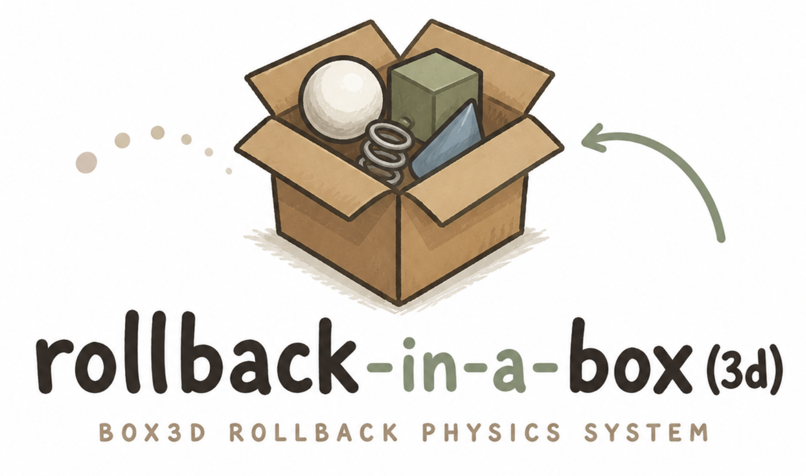

# rollback-in-a-box

<p align="center">
  
</p>

Deterministic network rollback physics for **Godot and Unreal**, powered by
[Box3D](https://github.com/erincatto/box3d) by Erin Catto.

The rollback and physics logic lives in an engine-neutral C++/C core
(`/core`) that depends only on Box3D. Each engine is a thin adapter over it —
there is one copy of the netcode, not two:

- **Godot 4 GDExtension** (`/gdext`) — `Box3DRollbackWorld`,
  `Box3DRollbackSession`, plus the generated `Box3D` raw-API facade and a
  replay viewer.
- **Unreal Engine 5.8 plugin** (`/unreal/Box3DRollback`) —
  `UBox3DRollbackWorld`, `UBox3DRollbackSession`, `IBox3DRollbackSimulation`,
  Blueprint-exposed.

The core provides deterministic full-world snapshots, hashes, recording, and
transport-agnostic rollback networking for 2-4 players (prediction, input
resend, acking, confirmed-frame hashes, desync detection, frame-advantage
throttling). Your game owns game rules, rendering, matchmaking, and byte
transport. See [Dual-engine architecture](docs/dual-engine-architecture.md).

## Highlights

- **2-4 player sessions.** Packets are broadcast; acknowledgement, pacing, and
  confirmed hashes are tracked per peer. 3- and 4-player sessions are tested
  under latency, jitter, and loss.
- **Build-fingerprint gating.** Every packet carries a determinism fingerprint
  (Box3D version, SIMD flavor and width, float evaluation mode, snapshot
  layouts, and a hashed simulation probe). Mismatched builds are rejected at
  the packet layer, making cross-platform play an enforced gate instead of a
  convention. Compare `Box3DRollbackSession.get_build_fingerprint()` during
  matchmaking.
- **Rollback scoping.** Games declare which bodies each player's input drives;
  each rollback computes the affected set (closure over contacts, joints, and
  swept AABBs) and reports scope telemetry. Resimulation stays full-world for
  correctness; sleeping islands already cost nothing to resimulate — see
  [Partial resimulation](docs/partial-resimulation.md).
- **Desync detection.** Confirmed-frame hashes are exchanged continuously and
  compared bit-for-bit; a divergence emits `desync_detected(frame)`.

## API coverage

The pinned Box3D revision currently exposes 695 public functions: 572 exported
`B3_API` functions and 123 public inline helpers. All 695 are represented by
the generated `Box3D` class with their exact C names. The generated
[API reference](docs/api-reference.md) and [machine-readable manifest](api/box3d-api.json)
are checked in CI, so an upstream API change cannot silently leave the binding
incomplete.

The behavioral suite creates every runtime shape family and every joint family
through this raw API. `Box3DRollbackWorld` remains a smaller convenience and
snapshot layer; it is not the boundary of Box3D coverage.

## Quick start

```sh
./gdext/setup_deps.sh
cmake -S gdext -B gdext/build-debug -G Ninja \
  -DCMAKE_BUILD_TYPE=Debug -DGODOTCPP_TARGET=template_debug
cmake --build gdext/build-debug
./tests/run_all.sh
```

Create a world through the complete raw API:

```gdscript
var box3d := Box3D.new()
var world_def: Dictionary = box3d.b3DefaultWorldDef()
world_def.gravity = Vector3(0, -9.8, 0)
var world_buffer := box3d.raw.make_buffer(&"b3WorldDef", world_def)
var world_id: int = box3d.b3CreateWorld(world_buffer)

var body_def: Dictionary = box3d.b3DefaultBodyDef()
body_def.type = box3d.raw.get_constants().b3_dynamicBody
body_def.position = Vector3(0, 4, 0)
var body_id: int = box3d.b3CreateBody(
  world_id,
  box3d.raw.make_buffer(&"b3BodyDef", body_def)
)

var shape_def := box3d.raw.make_buffer(&"b3ShapeDef", box3d.b3DefaultShapeDef())
var sphere := box3d.raw.make_buffer(&"b3Sphere", {
  "center": Vector3.ZERO,
  "radius": 0.5,
})
box3d.b3CreateSphereShape(body_id, shape_def, sphere)
box3d.b3World_Step(world_id, 1.0 / 60.0, 4)
```

Or use the deterministic convenience world and network session:

```gdscript
var world := Box3DRollbackWorld.new()
add_child(world)
world.set_input_count(2)
world.create_world()
world.add_static_box(Vector3(0, -1, 0), Vector3(20, 1, 20))
world.add_dynamic_box(Vector3(0, 4, 0), Vector3(0.5, 0.5, 0.5))

var session := Box3DRollbackSession.new()
session.set_simulation(world)
session.configure(0, 2, 2, 8)
session.start()
```

Send `session.get_packet()` through UDP, ENet, WebRTC, Steam networking, or a
relay. Pass received bytes unchanged to `session.ingest_packet(packet)`. For
3- or 4-player sessions, send every packet to every other peer and pass their
player count to `configure()`.

### Unreal Engine 5.8

```sh
./gdext/setup_deps.sh          # shared: clones the pinned Box3D
./unreal/build_thirdparty.sh   # builds box3d + neutral-core static libs
```

Then enable **Box3D Rollback** (`/unreal/Box3DRollback`) in a UE 5.8 project.
The Blueprint/C++ API mirrors the Godot classes; see the
[plugin README](unreal/Box3DRollback/README.md).

## Documentation

- [Dual-engine architecture](docs/dual-engine-architecture.md)
- [Unreal plugin](unreal/Box3DRollback/README.md)
- [Raw Box3D API](docs/raw-box3d-api.md)
- [API boundary](docs/api-boundary.md)
- [Generated API reference](docs/api-reference.md)
- [Build from source](docs/build-from-source.md)
- [Determinism contract](docs/determinism-contract.md)
- [Network rollback](docs/network-rollback.md)
- [Partial resimulation](docs/partial-resimulation.md)
- [Transport adapters](docs/transport-adapters.md)
- [Snapshots and hashing](docs/snapshots-and-hashing.md)
- [Testing](docs/testing.md)

## License

MIT. Box3D and godot-cpp are fetched at pinned upstream revisions and retain
their own licenses.
